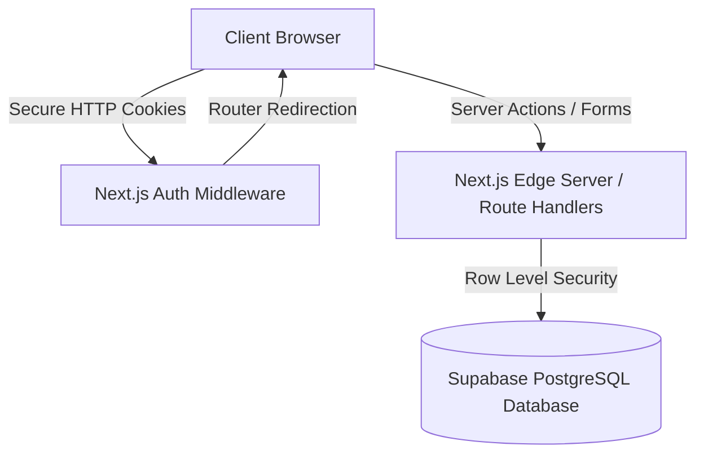

# Social Report Pro — Stage 1 System Architecture

This document describes the high-level system architecture and security boundaries implemented in Stage 1 of **Social Report Pro**.

---

## 🏛️ System Overview

---

## 🔑 Key Architectural Layers

### 1. Multi-Tenant Directory Structure
All user profiles, workspaces, and companies are strictly separated. The tenancy model follows the hierarchy:
`User` → `Workspace` → `Companies` → `Platform Connections` → `Analytics snapshots`

### 2. Next.js SSR Integration (Supabase SSR)
- Uses `@supabase/ssr` to configure isomorphic authentication.
- Access cookies are parsed server-side to resolve authenticated users.
- Protected routes redirect unauthenticated users to `/login` before rendering pages.
- Users who do not belong to any company are automatically routed to the onboarding/company creation flow.

### 3. State Management
- **CompanyProvider**: Holds global React context of available companies and the active company ID.
- Active company changes update query filter scopes, ensuring zero leakage of details between companies.

### 4. Permissions Guard
- Server actions execute `verifyCompanyPermission` to resolve the current user's membership and check if their role satisfies the permission requirement (`owner`, `admin`, `marketing_manager`, `viewer`).
- If authorization checks fail, the server rejects inputs, irrespective of visual button state.
