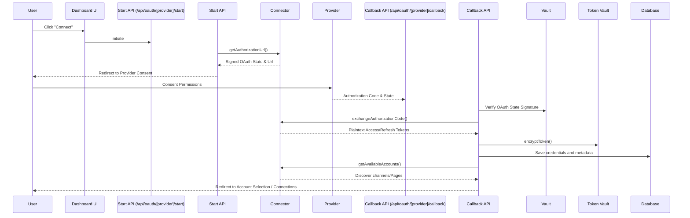

# Social platform Connector Architecture

This document describes the design and design patterns of the **Social Platform Connector Framework** implemented in Stage 2.

## Table of Contents
1. [Overview](#overview)
2. [Interface Contract](#interface-contract)
3. [Connector Registry](#connector-registry)
4. [Control Flow Diagrams](#control-flow-diagrams)
5. [Adding a New Provider](#adding-a-new-provider)

---

## Overview

The Connector Framework provides a uniform abstraction layer over diverse third-party APIs (Meta Graph API, Google API, TikTok API). Rather than spreading platform-specific conditional blocks across routes and server actions, we centralize integration logic inside structured connector classes matching a strict contract.

```
                  ┌───────────────────────┐
                  │   Connector Registry  │
                  └───────────┬───────────┘
                              │
         ┌────────────────────┼────────────────────┐
         ▼                    ▼                    ▼
┌─────────────────┐  ┌─────────────────┐  ┌─────────────────┐
│  Meta Facebook  │  │  Meta Instagram │  │ Google YouTube  │
└─────────────────┘  └─────────────────┘  └─────────────────┘
```

---

## Interface Contract

Every connector must implement the `SocialPlatformConnector` interface defined in [src/lib/connectors/types.ts](file:///C:/Users/Skyfall/.gemini/antigravity/scratch/social-report-pro/src/lib/connectors/types.ts):

```typescript
export interface SocialPlatformConnector {
  provider: SocialPlatform
  getCapabilities(): ProviderCapabilities
  getAuthorizationUrl(input: AuthorizationInput): Promise<AuthorizationResult>
  exchangeAuthorizationCode(input: CallbackInput): Promise<TokenResult>
  refreshAccessToken(refreshToken: string): Promise<TokenResult>
  revokeAccess(accessToken: string): Promise<void>
  getAvailableAccounts(accessToken: string): Promise<SelectableSocialAccount[]>
  validateConnection(accessToken: string): Promise<ConnectionHealthResult>
}
```

### Key Elements:
* **ProviderCapabilities**: Flags indicating platform abilities (e.g. `supportsTokenRefresh`, `requiresProfessionalAccount`).
* **SelectableSocialAccount**: Standardized structure for Pages, channels, and accounts returned to the user for mapping.
* **ConnectionHealthResult**: Clean classification of token status (e.g. `valid`, `expired`, `revoked`).

---

## Connector Registry

The `connectorRegistry` at [src/lib/connectors/registry.ts](file:///C:/Users/Skyfall/.gemini/antigravity/scratch/social-report-pro/src/lib/connectors/registry.ts) stores instances of all active connectors.

```typescript
import { FacebookConnector } from './facebook/connector'
// ...
connectorRegistry.register(new FacebookConnector())
```

To fetch a connector at runtime:
```typescript
const connector = connectorRegistry.get('youtube')
```

---

## Control Flow Diagrams

### OAuth & Connection Flow


---

## Adding a New Provider

To add a new platform connector (e.g. `linkedin`):
1. **Extend SocialPlatform Enum**: Add the new key to `SocialPlatform` inside [types.ts](file:///C:/Users/Skyfall/.gemini/antigravity/scratch/social-report-pro/src/lib/connectors/types.ts).
2. **Implement Connector**: Create `src/lib/connectors/linkedin/connector.ts` implementing `SocialPlatformConnector`.
3. **Register Connector**: Import and register the new connector class inside [registry.ts](file:///C:/Users/Skyfall/.gemini/antigravity/scratch/social-report-pro/src/lib/connectors/registry.ts).
4. **Environment Config**: Update `/api/oauth/config` to detect the new environment credentials.
